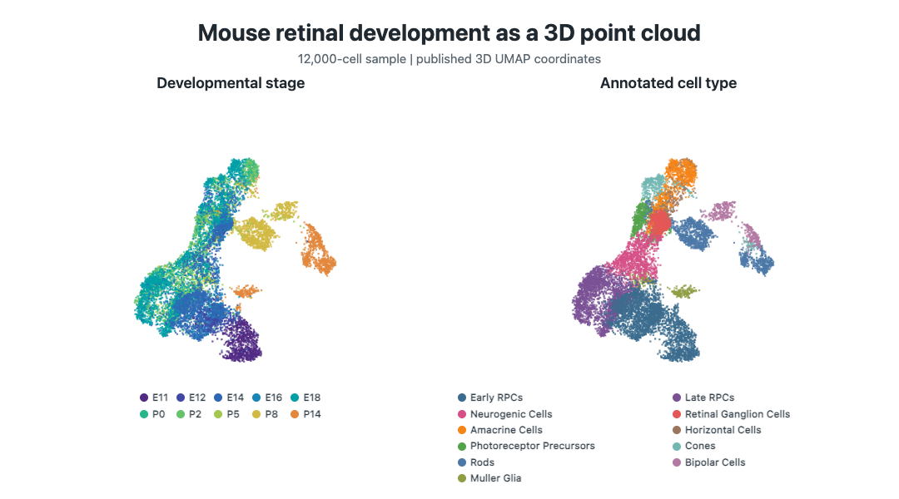
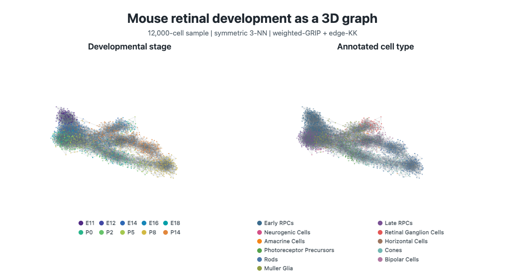

```{r setup, include=FALSE}
knitr::opts_chunk$set(collapse = TRUE, comment = "#>", out.width = "100%")
library(ivue)
```

This case study shows the same 12,000 mouse retinal-development cells in two
three-dimensional representations. The first is a published UMAP point cloud.
The second is a symmetric k-nearest-neighbor graph with an independently
computed graph layout. Holding cell identities, annotations, colors, and camera
motion fixed makes the representational change visible without implying that
the two geometries are equivalent.

`ivue` renders both views. It does not compute UMAP coordinates, construct the
graph, or optimize the graph layout.

## Load the prepared case study

The installed package includes a visualization-ready object. It contains two
coordinate matrices, a weighted edge table, categorical annotations, and
provenance. It contains no expression matrix, principal-component matrix,
barcodes, sample identifiers, or local source paths.

```{r load-data}
path <- system.file("extdata", "retinal-development.rds", package = "ivue")
if (!nzchar(path)) {
  candidates <- c(
    file.path("inst", "extdata", "retinal-development.rds"),
    file.path("..", "inst", "extdata", "retinal-development.rds")
  )
  path <- candidates[file.exists(candidates)][1]
}
retina <- readRDS(path)
dim(retina$coordinates$umap)
dim(retina$coordinates$sknn)
nrow(retina$graph$edges)
```

Rows have synthetic identifiers that agree across both coordinate matrices,
the graph, and the annotation table.

```{r identity-check}
ids <- retina$annotations$id
stopifnot(
  identical(rownames(retina$coordinates$umap), ids),
  identical(rownames(retina$coordinates$sknn), ids),
  identical(retina$graph$vertices, ids)
)
table(retina$annotations$age)
```

## Data lineage

The source is the retained mouse retinal-development single-cell RNA-seq data
from [Clark et al. (2019)](https://pmc.ncbi.nlm.nih.gov/articles/PMC6768831/),
available as [GEO GSE118614](https://www.ncbi.nlm.nih.gov/geo/query/acc.cgi?acc=GSE118614).
The published analysis fitted 20 principal components to `log10(CPT + 1)`
values for 3,290 high-variance genes in 120,804 cells, then retained 107,052
retinal cells. Its three-dimensional UMAP used Canberra distance.

The case-study sample contains 12,000 retained cells selected reproducibly
across nonempty developmental-stage-by-cell-type strata, with a minimum of 20
cells per stratum and seed 20190619. Both views use those exact identities in
the same order.

## Shared categorical scales

Named palettes make annotation colors independent of factor order and reusable
across coordinate systems.

```{r scales}
age.colors <- c(
  E11 = "#512A84", E12 = "#4148A4", E14 = "#2E68B4",
  E16 = "#1686B7", E18 = "#009FA8", P0 = "#28B58B",
  P2 = "#67C36B", P5 = "#A4C84F", P8 = "#D2B943", P14 = "#E2873C"
)
cell.colors <- c(
  "Early RPCs" = "#3B6C8E", "Late RPCs" = "#7A5195",
  "Neurogenic Cells" = "#D45087", "Retinal Ganglion Cells" = "#E45756",
  "Amacrine Cells" = "#F58518", "Horizontal Cells" = "#9C755F",
  "Photoreceptor Precursors" = "#54A24B", Cones = "#72B7B2",
  Rods = "#4C78A8", "Bipolar Cells" = "#B279A2",
  "Muller Glia" = "#8F9D44"
)
age.scale <- color.scale.groups(retina$annotations$age, colors = age.colors)
cell.scale <- color.scale.groups(
  retina$annotations$cell.type, colors = cell.colors
)
camera <- camera.zup(elevation = 18, turn = -28, fov = 0, zoom = 0.57)
```

## Published UMAP as a point cloud

The UMAP coordinates are taken from the published metadata and centered only
for display. No UMAP fitting or graph construction occurs in this vignette.
`plot3D.groups()` associates annotation values with coordinate rows.

```{r umap-code, eval=FALSE}
umap.by.age <- plot3D.groups(
  retina$coordinates$umap,
  groups = retina$annotations$age,
  scale = age.scale,
  point.size = 2.2,
  alpha = 0.78,
  axes = FALSE,
  aspect = "equal",
  camera = camera
)
umap.by.age
```

```{r umap-poster, echo=FALSE}

```

## Symmetric kNN graph and independent layout

For the graph view, `dgraphs` constructed Euclidean symmetric kNN graphs from
the same 20-PC representation used upstream of UMAP. Candidate values were
considered from low to high; the selected value, 3, was the smallest whose
graph was connected for three consecutive candidates. `grip` then computed a
weighted-GRIP initialization followed by edge-KK refinement. The graph was not
constructed from UMAP coordinates.

`prepare.graph()` validates the bundled edge table without loading `rgl` or
recomputing a layout. The weights are declared as distances, but visual edge
width is chosen explicitly rather than inferred from them.

```{r prepare-graph}
graph <- prepare.graph(retina$graph)
nrow(graph$vertices)
nrow(graph$edges)
graph$weight.type
```

```{r graph-code, eval=FALSE}
graph.by.age <- plot3D.graph(
  graph,
  X = retina$coordinates$sknn,
  groups = retina$annotations$age,
  scale = age.scale,
  point.size = 2.1,
  alpha = 0.84,
  edge.col = "#59687324",
  edge.width = 1,
  axes = FALSE,
  aspect = "equal",
  camera = camera
)
graph.by.age
```

```{r graph-poster, echo=FALSE}

```

## Change the annotation, not the geometry

The cell-type view reuses the coordinates, graph, camera, and rendering
settings. Only `groups` and `scale` change.

```{r cell-type-code, eval=FALSE}
umap.by.cell.type <- plot3D.groups(
  retina$coordinates$umap,
  groups = retina$annotations$cell.type,
  scale = cell.scale,
  point.size = 2.2,
  alpha = 0.78,
  axes = FALSE,
  aspect = "equal",
  camera = camera
)

graph.by.cell.type <- plot3D.graph(
  graph,
  X = retina$coordinates$sknn,
  groups = retina$annotations$cell.type,
  scale = cell.scale,
  point.size = 2.1,
  alpha = 0.84,
  edge.col = "#59687324",
  edge.width = 1,
  axes = FALSE,
  aspect = "equal",
  camera = camera
)
```

This separation is useful when comparing views: changing geometry should not
silently change the sampled observations, annotation mapping, or palette.

## Interpretation and boundaries

The UMAP and graph-layout coordinates answer different visualization
questions. UMAP displays a nonlinear embedding produced by its own neighbor
and optimization choices. The graph layout displays one selected symmetric
kNN topology and its weighted drawing objective. Apparent proximity in either
view is not evidence that the other representation contains the same
neighborhoods.

A quantitative comparison of Euclidean and Canberra neighbor sets on the
underlying 20-PC matrix is maintained as a reproducible
[`dgraphs` methodological report](https://github.com/pgajer/dgraphs/tree/main/reports/retinal-neighbor-metric-comparison).
That analysis belongs to graph construction; this vignette focuses on how
`ivue` receives and renders the resulting coordinates, edges, and annotations.

## Reproduction and provenance

The README animations use the same bundled visualization values but are
captured as synchronized 72-frame rotations. In the source repository,
`make readme-retinal` reconstructs the upstream PC matrix and graph layout,
renders both HTML scenes, verifies their WebGL canvases, and encodes the GIFs.
The animations, case-study object, and vignette posters are regenerated with:

```{r regeneration, eval=FALSE}
make retinal-vignette
```

The stored provenance records source checksums, graph-selection diagnostics,
layout information, and the versions of the packages that computed the graph
and layout.

```{r provenance}
retina$provenance[c("citation", "sample", "umap")]
retina$provenance$graph.input
retina$provenance$graph.selection$selected
retina$provenance$graph.layout$method
```
